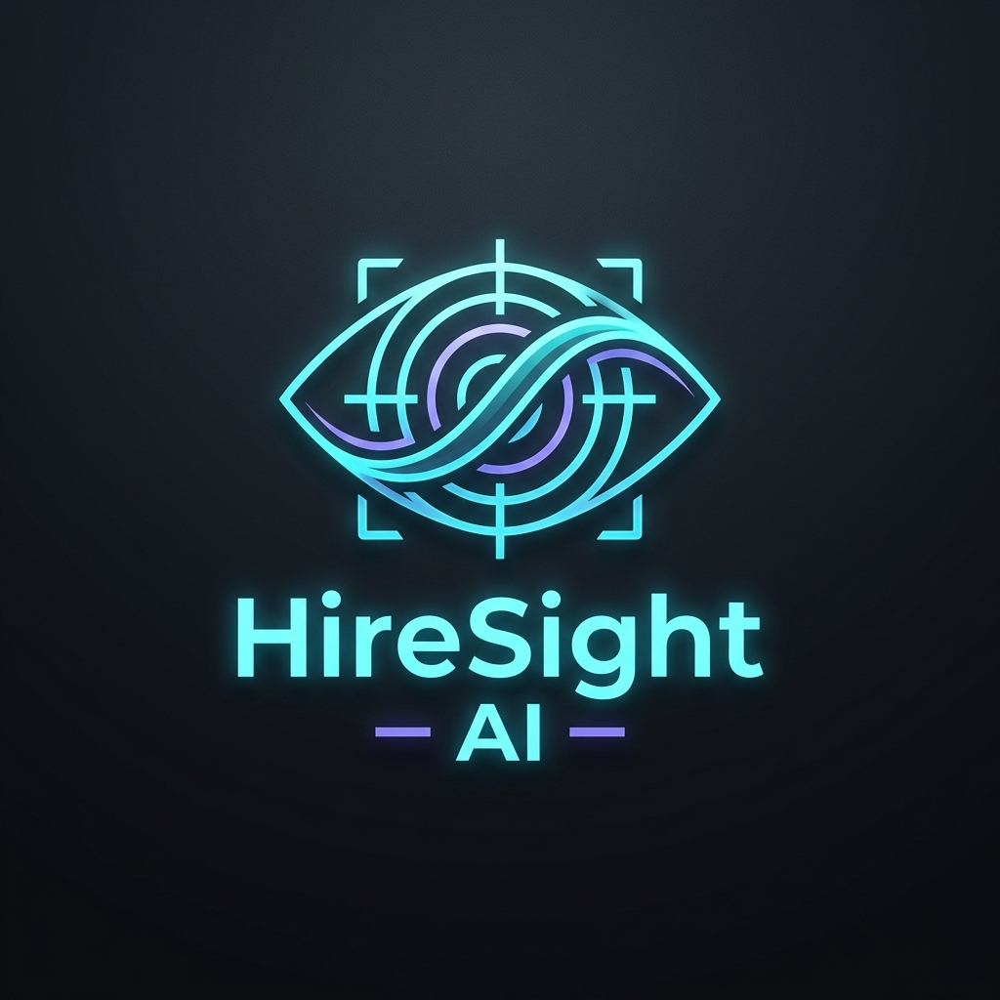

<div align="center">

  

  # HireSight AI
  ### The Flagship AI-Powered ATS Intelligence Platform

  [](https://fastapi.tiangolo.com/)
  [](https://vitejs.dev/)
  [](https://python.org)
  [](https://hiresight-ai.vercel.app)
  
  **HireSight AI** is a professional-grade ATS Resume Analyzer designed to empower candidates with recruiter-level intelligence. Built with a high-performance FastAPI backend and a cinematic, app-like frontend experience.

</div>

---

## 📸 Project Preview

<div align="center">
  <p><i>Premium Workspace & Analysis Dashboard</i></p>
  
  <!-- Replace with actual screenshots -->


  <p><i>[ Screenshots are placeholders - Update with real visuals ]</i></p>
</div>

---

## 🚀 About the Project

In the modern job market, **75% of resumes are never seen by a human recruiter**. They are filtered out by legacy Applicant Tracking Systems (ATS) due to formatting errors or keyword mismatches. 

**HireSight AI** solves this by providing:
- **Semantic Intelligence**: Using NLP to understand the *impact* of your experience, not just keywords.
- **Recruiter Calibration**: Analyzing your resume against specific Job Descriptions (JD) to calculate match scores.
- **Immediate Optimization**: Real-time suggestions to rephrase and restructure content for maximum ATS compatibility.

---

## ✨ Core Features

- **🔍 Intelligent ATS Analysis**: Detects parsing vulnerabilities in complex PDF/DOCX layouts.
- **🎯 Semantic Match Engine**: High-fidelity similarity scoring between Resume and Job Description.
- **📈 Real-time Key-skill Detection**: Identifies missing hard and soft skills required for the target role.
- **🎨 Premium UI/UX**: An Apple-inspired, glassmorphic workspace designed for a focused user experience.
- **📱 App-like Mobile Flow**: Fully optimized mobile web experience with tactile interactions and PWA support.
- **⚡ Async Processing**: Scalable FastAPI infrastructure for lightning-fast file ingestion and analysis.

---

## 🛠️ Tech Stack

| Layer | Technology |
| :--- | :--- |
| **Frontend** | Vite, Vanilla JavaScript (ES6+), Modern CSS (Design System) |
| **Backend** | FastAPI (Python 3.12), Pydantic v2, Uvicorn |
| **AI / NLP** | spaCy, scikit-learn, Sentence Transformers, Groq/OpenAI |
| **Parsing** | pdfplumber, python-multipart, aiofiles |
| **Deployment** | Vercel (Frontend), Render / DigitalOcean (Backend) |

---

## 📐 Architecture Overview

The project follows a modular, service-oriented architecture designed for scalability and maintainability.

```text
hiresight-ai/
├── client/                 # Vite Frontend Application
│   ├── src/
│   │   ├── pages/          # View components (Home, Analyzer)
│   │   ├── services/       # State, Router, and API logic
│   │   └── styles/         # Modular Design System (tokens, components)
│   └── public/             # Static brand assets & logos
├── server/                 # FastAPI Intelligence Backend
│   ├── app/
│   │   ├── api/            # API Route definitions & endpoints
│   │   ├── core/           # Config, Security, and Settings
│   │   ├── services/       # Business logic (Parser, ATS, AI)
│   │   └── ai/             # NLP Models & ML logic
│   └── requirements.txt    # Python dependency manifest
├── package.json            # Root orchestration (concurrent dev)
└── .gitignore              # Multi-stack exclusion rules
```

---

## 💎 UI/UX Philosophy

HireSight AI is built with a **"Product-First"** mindset. The design language is inspired by industry leaders like **Linear** and **Vercel**:
- **Confident Typography**: Using 'Outfit' and 'Inter' for a bold, authoritative hierarchy.
- **Visual Depth**: Subtle radial gradients, glassmorphism, and frosted surfaces for an immersive workspace.
- **Tactile Mobile Experience**: Native-feeling interactions on mobile, including spring-based tap animations and floating navigation.

---

## 🛠️ Installation & Setup

### **1. Clone the Repository**
```bash
git clone https://github.com/arupdas0825/HireSight-AI.git
cd hiresight-ai
```

### **2. Install Dependencies**
The root directory includes a unified installer for both stacks:
```bash
npm run install-all
```

### **3. Environment Configuration**
Create a `.env` file in the `server/` directory:
```env
OPENAI_API_KEY=your_key
GROQ_API_KEY=your_key
PORT=5000
ENVIRONMENT=development
```

### **4. Launch the Platform**
Run both the frontend and backend concurrently:
```bash
npm run dev
```
- **Frontend**: [http://localhost:5173](http://localhost:5173)
- **Backend API**: [http://localhost:5000](http://localhost:5000)
- **API Docs**: [http://localhost:5000/docs](http://localhost:5000/docs)

---

## 📡 API Overview

| Method | Endpoint | Description |
| :--- | :--- | :--- |
| `POST` | `/api/upload` | Uploads resume and returns extracted semantic text. |
| `POST` | `/api/analyze` | Compares resume text vs. Job Description using AI. |
| `GET` | `/api/health` | Backend status check. |

---

## 🗺️ Roadmap

- [ ] **AI Interview Assistant**: Generate tailored interview questions based on resume gaps.
- [ ] **Multi-format Export**: Download ATS-optimized versions of your resume.
- [ ] **Recruiter Dashboard**: Analytics for hiring managers to track top-matching candidates.
- [ ] **Global Support**: Multilingual resume analysis and localization.

---

## 👨‍💻 Author

**Arup Das**  
*Full-Stack AI Developer*

[](https://github.com/arupdas0825)
[](https://linkedin.com/in/arup-das-825a0b25a)
[](https://arup.dev)

---

## 📜 License

This project is licensed under the **MIT License** - see the [LICENSE](LICENSE) file for details.

---
<div align="center">
  Built with ❤️ for the future of recruitment.
</div>
